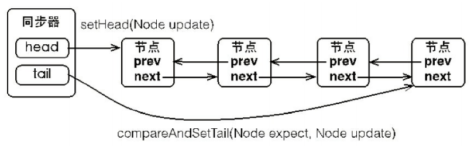

# 一、基本概念

&ensp;&ensp;&ensp;&ensp;AQS全称AbstractQueuedSynchronizer，抽象式的队列同步器。干什么用的呢？AQS定义了一套多线程访问共享资源的同步器框架。为什么说是框架呢，因为它并不是直接实现了同步器功能，而是提供了一套基础的功能，许多同步类都依赖它，诸如ReetrantLock（可重入锁）、Semaphore（信号量）、CountDownLatch（多线程访问计数）

该框架结构如图：



&ensp;&ensp;&ensp;&ensp;它维护了一个volatile修饰的int类型变量state（表示共享资源）和一个双向的FIFO线程等待队列（同步器嘛，肯定是会有等待的噻，等待的线程放入等待队列），同步队列拥有指向头结点的head节点和指向尾节点的tail节点。volatile保证资源状态的更新可以对其它线程可见，具体细节不赘述。state表示共享资源，访问方式有三种：

- getState（）
- setState（）
- compareAndSetState（）

&ensp;&ensp;&ensp;&ensp;结合线程获取锁的场景可以理解state共享变量就是一个锁标记，有获取锁操作，有获取到了上锁操作（要释放的时候解锁操作）和基于CAS形式的上锁/解锁操作（该方法可以保证原子性）。

&ensp;&ensp;&ensp;&ensp;AQS定义了两种资源共享方式，一种是Exclusive（读占式，只有一个线程可以占用如ReentrantLock），另一种是Share（共享式，可以被多个线程占用，如读锁，CountDownLatch，Semaphore）

&ensp;&ensp;&ensp;&ensp;前文说到，AQS主要是提供一种并发访问资源的框架，其具体需要使用哪种共享方式需要根据不同的自定义同步器来决定。AQS的设计是基于模板方法模式的，也就是说使用者（自定义同步器）需要继承同步器AQS并重写相应的方法，然后将同步器AQS组合在我们的自定义同步组件中，并调用AQS提供的模板方法，该方法会调用我们重写的方法来完成相应的功能。

&ensp;&ensp;&ensp;&ensp;自定义同步器需要实现的方法是共享资源state的获取与释放，至于线程等待队列的维护等一系列操作都由AQS实现好了，自定义同步器主要实现以下方法：

- boolean tryAcquire（int）：独占式尝试获取资源，成功返回true，失败返回false
- boolean tryRelease（int）：独占式尝试释放资源，成功返回true，失败返回false
- int tryAcquireShared（int）：共享式尝试获取资源，负数表示失败，0表示成功但没有剩余可用资源，正数表示成功且有剩余可用资源
- boolean tryReleaseShared（int）：共享式尝试释放资源，如果释放之后允许唤醒后续等待节点则返回true，否则返回false
- isHeldExculsively（）：该线程是否独占资源，只有用到Condition才去实现它

&ensp;&ensp;&ensp;&ensp;以ReentrantLock为例，共享资源state初始化为0，当线程A调用Lock.lock（）方法之后，会调用tryAcqurie（）方法获取独占锁并将state+1，后续其它线程再调用lock（）方法时会报错，当前线程可以继续调用，state继续+1，这是重入锁的概念，获取了多少次锁就需要释放多少次锁，最终目的是保证state状态等于0，以便其它线程有机会可以获取到锁。

&ensp;&ensp;&ensp;&ensp;以CountDownLatch为例，在没看源码之前，一直认为CountDownLatch是通过类似wait/notify的形式实现的。实际上对于CountDownLatch，当将任务分成N个线程执行时，state也被初始化为N，两个N相同，然后调用了await（）方法的线程会阻塞直到state归零，其它子线程执行完对应任务之后，显示的调用countDown（）方法之后，共享资源state会以CAS的方式减一，直到减为0之后可以unpark（）主线程继续执行后续任务。

&ensp;&ensp;&ensp;&ensp;通常情况下，自定义同步器都是独占或者共享中的一种，有特殊的就是ReentrantReadWriteLock（），实现了独占和共享两种方式。

- 小结：AQS是抽象式的队列同步器，基本框架是维护了一个volatile类型的变量和FIFO双端链表队列主要是通过模板方法模式为其它自定义同步类提供并发下的队列等待等功能，至于获取资源和释放资源的实现由自定义同步器自己完成。AQS主要分为独占式和共享式两种，实现哪种自己决定，也可以都实现。

# 二、源码分析

&ensp;&ensp;&ensp;&ensp;本章开始分析AQS源码，前文说到AQS提供了模板方法来供自定义同步器访问然后调用重写的方法。这里分析源码中提供的模板方法以及其它诸如等待队列的相关实现。（重写方法我们在这里也分析不了啊哈哈~）我们按照独享式acquire-release和共享式acquireShared-releaseShared的顺序进行分析

## 2.1acquire（int）

```java
public final void acquire(int arg) {
        if (!tryAcquire(arg) &&
            acquireQueued(addWaiter(Node.EXCLUSIVE), arg))
            selfInterrupt();
    }
```

&ensp;&ensp;&ensp;&ensp;此方法是独占模式下线程获取共享资源的顶层入口，如果获取到了资源则直接返回，否则进入等待队列，直至获取到资源为止。**且这个过程忽略中断的影响**，是不是与lock（）相同了。获取到共享资源之后就可以执行临界区代码了。

方法流程如下：

1. tryAcquire（）尝试直接获取资源，获取到直接返回；
2. addWaiter（）将线程加入到等待队列的尾部，并标记为独占模式；
3. acqurieQueued（）队列中线程处理方法，不断尝试使队列中的线程可以获取资源，直到成功后返回。如果在等待过程中被中断过，则返回true，否则返回false；
4. 如果线程在等待过程中被中断过，它是不响应的，直到成功返回之后，再进行自我中断，将中断补上。

&ensp;&ensp;&ensp;&ensp;这里的设计利用了&&短路的方式简化了编码，首先&&左边调用tryAcquire（）尝试直接获取资源，如果获取成功则tryAcquire（）返回true，方法前加了！将&&左半边的结果置为false，通过&&短路的功能不继续执行后续的操作。其它细节问题我们按顺序梳理：

### 2.1.1tryAcquire（int）

```java
    protected boolean tryAcquire(int arg) {
        throw new UnsupportedOperationException();
    }
```

&ensp;&ensp;&ensp;&ensp;这个方法尝试获取共享资源，如果成功则返回true，否则返回false，emmm那么为什么这里描述的与代码不符呢。因为前边说到这个方法是需要在自定义同步器中被重写的，比如在ReentrantLock中重写该方法。因此这里源码只抛出了异常，具体不同自定义同步器如何重写就等到学习对应源码的时候再看啦。不过前边也说到，基本的资源操作只有get/set/CAS三种方式。这个需要被重写方法没有设计成abstract形式，是因为一般情况下独占式只需要重写独占式对应的tryAcquire和tryRelease方法，而共享式也仅重写共享式的两个方法，这里避免了每个模式都需要实现以下另一个模式的接口的情况。

### 2.1.2addWaiter（Node）

该方法用于将等待线程放入到队列尾端，并返回当前线程节点。

```java
    private Node addWaiter(Node mode) {
        //新建一个Node类型的节点 mode是AQS模式，独占EXCLUSIVE；共享SHARED
        Node node = new Node(Thread.currentThread(), mode);
        // Try the fast path of enq; backup to full enq on failure
        //尝试使用最快的方式直接放到队尾
        Node pred = tail;
        if (pred != null) {
            node.prev = pred;
            if (compareAndSetTail(pred, node)) {
                pred.next = node;
                return node;
            }
        }
        //失败则使用另一种形式添加
        enq(node);
        return node;
    }
```

&ensp;&ensp;&ensp;&ensp;如上代码注释，创建一个Node类型的节点，然后尝试通过CAS设置队尾节点为当前节点，如果设置失败则通过enq（）方法完成入队。

#### 2.1.2.1Node

我们看一下Node的结构，Node是一个静态内部类，主要内容如下：

```java
static final class Node{
        /** Marker to indicate a node is waiting in shared mode */
        static final Node SHARED = new Node();
        /** Marker to indicate a node is waiting in exclusive mode */
        static final Node EXCLUSIVE = null;

        /** waitStatus value to indicate thread has cancelled */
        static final int CANCELLED =  1;
        /** waitStatus value to indicate successor's thread needs unparking */
        static final int SIGNAL    = -1;
        /** waitStatus value to indicate thread is waiting on condition */
        static final int CONDITION = -2;
        /**
         * waitStatus value to indicate the next acquireShared should
         * unconditionally propagate
         */
        static final int PROPAGATE = -3;

        volatile int waitStatus;

        volatile Node prev;

        volatile Node next;

        volatile Thread thread;

        Node nextWaiter;

        final boolean isShared() {
            return nextWaiter == SHARED;
        }

        final Node predecessor() throws NullPointerException {
            Node p = prev;
            if (p == null)
                throw new NullPointerException();
            else
                return p;
        }

        Node() {    // Used to establish initial head or SHARED marker
        }

        Node(Thread thread, Node mode) {     // Used by addWaiter
            this.nextWaiter = mode;
            this.thread = thread;
        }

        Node(Thread thread, int waitStatus) { // Used by Condition
            this.waitStatus = waitStatus;
            this.thread = thread;
        }
}    
```

&ensp;&ensp;&ensp;&ensp;Node节点是对每一个访问共享资源的线程的封装，主要包含了线程本身以及线程状态（是否阻塞、是否等待唤醒、是否被取消等等）。变量waitStatus表示当前线程被封装成Node节点的等待状态，共有四种取值，CANCELLED、SIGNAL、CONDITION、PROPAGATE：

- CANCELLED：值为1，表示线程被取消，被取消了的线程不会参与资源获取，状态不会再改变，直至该节点被GC收回。
- SIGNAL：值为-1，表示该节点如果执行完成之后，会唤醒其后续节点。
- CONDITION：值为-2，表示该节点等待在Condition上，当其他线程的Condition调用了singal（）方法后，该线程会从等待队列移到同步队列中，加入到同步状态的获取。
- PROPAGATE：值为-3，表示下一次共享式同步状态获取会被无条件传播下去。
- 默认值为0，表示初始化状态。

AQS判断状态时，当waitStatus>0时表示无效状态，waitStatus<0时表示有效状态。

#### 2.1.2.2compareAndSetTail

该代码通过底层UNSFATE方式完成CAS操作。关于UNSFAE相关内容这里不做讨论。

```java
    private final boolean compareAndSetTail(Node expect, Node update) {
        return unsafe.compareAndSwapObject(this, tailOffset, expect, update);
    }
```

#### 2.1.2.3enq（Node）

该方法是另外一种设置队列尾节点的方式。

```java
    private Node enq(final Node node) {
        //自旋进行CAS操作，直至成功变成尾节点
        for (;;) {
            Node t = tail;
            //尾节点为空则表示队列为空，初始化一个头节点，该节点也为尾节点
            if (t == null) { // Must initialize
                if (compareAndSetHead(new Node()))
                    tail = head;
            } else {
                //否则的话就与前边快速流程相同
                node.prev = t;
                if (compareAndSetTail(t, node)) {
                    t.next = node;
                    return t;
                }
            }
        }
    }
```

### 2.1.3acquireQueued（Node，int）

&ensp;&ensp;&ensp;&ensp;我们通过tryAcquire（）形式获取资源失败了，然后将当前线程放入到了等待队列中，接下来就是对等待队列中的线程进行处理操作了，是进行等待唤醒状态，还是可以尝试获取锁然后完成临界区操作。

```java
    final boolean acquireQueued(final Node node, int arg) {
        //是否失败（这里开始理解错了，不细心容易产生歧义）
        boolean failed = true;
        try {
            //是否响应了中断
            boolean interrupted = false;
            //自旋操作
            for (;;) {
                //获取当前节点的前驱节点
                final Node p = node.predecessor();
                //如果前驱节点为head，那么就可以尝试获取锁了（这里可能是被前驱通知了，也可以）
                if (p == head && tryAcquire(arg)) {
                    //如果获取成功则把当前节点置为头节点
                    setHead(node);
                    //当前节点跳过它的前驱变成头结点，原来的头结点也就是前驱就无效了，等待被GC回收
                    p.next = null; // help GC
                    //获取成功，则把失败标记置为false
                    failed = false;
                    //返回是否响应了中断
                    return interrupted;
                }
               //这里同样用到了&&短路的操作，首先判断获取锁失败之后是否可以进入等待唤醒状态，如果可以则等待被唤醒变判断是否响应了中断以便返回中断信息
                if (shouldParkAfterFailedAcquire(p, node) &&
                    parkAndCheckInterrupt())
                    interrupted = true;
            }
        } finally {
            //避免在获取锁的过程中发生异常
            if (failed)
                cancelAcquire(node);
        }
    }
```

继续看一下shouldParkAfterFailedAcquire（Node，Node）方法

#### 2.1.3.1shouldParkAfterFailedAcquire（Node，Node）

&ensp;&ensp;&ensp;&ensp;这个方法是判断当前线程是不是在当前队列位置中就不动了，如前边所说，万一前边的线程取消了，或者是释放了，那么队列中的节点就要一点一点向前移动。

```java
private static boolean shouldParkAfterFailedAcquire(Node pred, Node node) {
    	//前驱节点的等待状态
        int ws = pred.waitStatus;
    	//如前边介绍样，当前驱节点的状态为SIGNAL时，表示它结束之后会通知当前节点
        if (ws == Node.SIGNAL)
            /*
             * This node has already set status asking a release
             * to signal it, so it can safely park.
             */
            return true;
    //大于0的状态只有取消一种，所以将当前节点前移直到前驱是有效节点处
        if (ws > 0) {
            /*
             * Predecessor was cancelled. Skip over predecessors and
             * indicate retry.
             */
            do {
                node.prev = pred = pred.prev;
            } while (pred.waitStatus > 0);
            pred.next = node;
        } else {
            /*
             * waitStatus must be 0 or PROPAGATE.  Indicate that we
             * need a signal, but don't park yet.  Caller will need to
             * retry to make sure it cannot acquire before parking.
             */
            //除了SIGNAL之外的有效状态，尝试将其设置成SIGNAL状态
            compareAndSetWaitStatus(pred, ws, Node.SIGNAL);
        }
    	//没有到可以等待唤醒的状态话继续外部的自旋操作
        return false;
    }
```

然后看下如果返回可以等待唤醒之后的代码也就是返回true之后&&右边的parkAndCheckInterrupt（）

#### 2.1.3.2parkAndCheckInterrupt（）

```java
    private final boolean parkAndCheckInterrupt() {
        LockSupport.park(this);
        return Thread.interrupted();
    }
```

这个方法调用LockSupport的park方法使当前线程等待，当等待结束之后检查是否发生了中断。

&ensp;&ensp;&ensp;&ensp;至此，acquireQueued（Node，int）方法就梳理清楚了：首先是进行自旋操作，自旋内部一步一步的移动当前线程节点，直到可以获取共享资源，否则的话就移动到一个可以安全等待通知的节点等待唤醒，最后需要返回是否响应了中断，结合最外部的acquire（int）方法来看，需要判断是否进行了中断，因为需要自己弥补中断。

### 2.1.4小结

综上所述，acquire（int）的流程：

1. 先通过tryAcquire（）尝试获取资源，如果能获取到资源则直接处理临界区操作；
2. 如果获取资源失败则调用addWaiter（）将线程存储为Node节点放入等待队列队尾；
3. 因为队列是FIFO形式，因此需要自旋判断当前节点的最佳等待节点等待唤醒，唤醒之后尝试获取锁并返回是否响应过中断；
4. 如果响应过中断则自己弥补一下中断。

这个流程也就是Lock.lock（）的流程，查看源码可以看见lock（）方法只执行了一个acquire（1）

## 2.2release（int）

&ensp;&ensp;&ensp;&ensp;上一小节说完了acquire，这里说它的反向操作，也就是释放资源。release（int）这个方法是独占式同步器释放资源的顶层入口，同样是通过get/set/cas操作共享资源完成，如果完全释放了资源即state=0时，将会唤醒等待队列中的线程来获取资源，即上边自旋操作中处于等待状态节点的线程会被唤醒，从而尝试获取资源退出自旋。

```java
    public final boolean release(int arg) {
        //与获取资源时相同，尝试调用重写的同步器方法释放资源
        if (tryRelease(arg)) {
            Node h = head;
            if (h != null && h.waitStatus != 0)
                //唤醒等待队列里的下一个节点（当前进行释放的线程为头结点）
                unparkSuccessor(h);
            return true;
        }
        return false;
    }
```

&ensp;&ensp;&ensp;&ensp;这个方法判断资源是否成功释放是通过tryRelease（）方法的返回值判断的，因此在自定义同步器中重写该方法时需要注意返回值的问题。

### 2.2.1tryRelease（int）

```java
    protected boolean tryRelease(int arg) {
        throw new UnsupportedOperationException();
    }
```

该方法前边说过，是需要由自定义同步器重写的，因此此处只抛出异常。

### 2.2.2unparkSuccessor（Node）

该方法通过unpark方式唤醒队列中的下一个线程节点

```java
    private void unparkSuccessor(Node node) {
        /*
         * If status is negative (i.e., possibly needing signal) try
         * to clear in anticipation of signalling.  It is OK if this
         * fails or if status is changed by waiting thread.
         */
        //获取当前节点状态（传入的节点为头节点，即当前即将释放资源的节点）
        int ws = node.waitStatus;
        //如果线程状态正常，则通过CAS的形式将其置为0 表示该线程节点要离开了（释放资源的线程节点）
        if (ws < 0)
            compareAndSetWaitStatus(node, ws, 0);

        /*
         * Thread to unpark is held in successor, which is normally
         * just the next node.  But if cancelled or apparently null,
         * traverse backwards from tail to find the actual
         * non-cancelled successor.
         */
        //获取下一个节点准备唤醒
        Node s = node.next;
        //如果下一个节点为空或者等待状态为取消态
        if (s == null || s.waitStatus > 0) {
            //从后向前遍历最后一个状态正常的节点
            s = null;
            for (Node t = tail; t != null && t != node; t = t.prev)
                if (t.waitStatus <= 0)
                    //赋值即将唤醒的节点
                    s = t;
        }
        //唤醒线程
        if (s != null)
            LockSupport.unpark(s.thread);
    }
```

&ensp;&ensp;&ensp;&ensp;这个方法概括起来就是唤醒等待队列中最前边的没有放弃的线程，这里和acquireQueued（）方法的自旋结合起来看，当线程唤醒，自旋里的parkAndCheckInterrupt（）会返回，然后进入自旋初始判断状态，即判断当前节点是否为head，即使不为head也没有关系，因为前边遍历过了它前边的节点均已为放弃状态，因此通过shouldParkAfterFailedAcquire（）之后，必然会到达头节点，然后获取资源，然后执行临界区方法！

### 2.2.3小结

&ensp;&ensp;&ensp;&ensp;release（int）方法是独占式同步器的顶层入口，它会释放指定的资源，如果资源释放完毕即state=0，那么它会唤醒等待队列中的下一个节点获取同步资源。

## 2.3acquireShared（int）

&ensp;&ensp;&ensp;&ensp;前边两节说的是独占式同步器获取/释放方式，接下来说共享式同步器获取/方式。这个方法是共享式线程获取共享资源的顶层入口。它获取成功直接返回，获取失败则将线程放入等待队列。获取过程中忽略中断。

```java
    public final void acquireShared(int arg) {
        //调用重写的方法尝试获取指定个数资源
        if (tryAcquireShared(arg) < 0)
            //将线程放入等待队列
            doAcquireShared(arg);
    }
```

&ensp;&ensp;&ensp;&ensp;同样是先通过重写的同步器方法tryAcquireShared（）获取指定个数的资源，这个方法在AQS中定义好了返回值的语义，返回小于0表示获取失败，返回0表示获取成功但没有剩余资源，返回大于0表示获取成功并且还有剩余资源。获取失败之后会将线程放入等待队列。

### 2.3.1tryAcquireShared（int）

该方法为自定义同步器需要重写的方法，基类方法抛出异常信息

```java
    protected int tryAcquireShared(int arg) {
        throw new UnsupportedOperationException();
    }
```

### 2.3.2doAcquireShared（int）

该方法将线程放入等待队列队尾

```java
    private void doAcquireShared(int arg) {
        //创建Node节点 节点类型为 方法与独占式的相同 区别在节点模式变为SHARED
        final Node node = addWaiter(Node.SHARED);
        //是否失败标记
        boolean failed = true;
        try {
            //中断标记
            boolean interrupted = false;
            //自旋操作
            for (;;) {
                //获取当前节点的前驱
                final Node p = node.predecessor();
                //如果前驱为head 也就是当前节点为第二个节点
                if (p == head) {
                    //尝试获取指定个数资源
                    int r = tryAcquireShared(arg);
                    //如果还有剩余
                    if (r >= 0) {
                        //将head指向自己，因当前资源剩余 因此唤醒后边的线程
                        setHeadAndPropagate(node, r);
                        //辅助前驱进行GC
                        p.next = null; // help GC
                        //被中断过则自己弥补中断
                        if (interrupted)
                            selfInterrupt();
                        failed = false;
                        return;
                    }
                }
                //前驱不为head 则寻找安全等待唤醒点 与独占模式相同
                if (shouldParkAfterFailedAcquire(p, node) &&
                    parkAndCheckInterrupt())
                    interrupted = true;
            }
        } finally {
            if (failed)
                cancelAcquire(node);
        }
    }
```

&ensp;&ensp;&ensp;&ensp;通读这个方法的代码，与独占式基本相同。区别在于将自身中断的过程放在了方法内部。另外一个区别是因为是共享资源，所以当前线程如果发现资源有剩余时会唤醒下一个线程。

#### 2.3.2.1setHeadAndPropagate（Node，int）

```java
    private void setHeadAndPropagate(Node node, int propagate) {
        //获取头节点
        Node h = head; // Record old head for check below
        //将当前节点设置成头结点
        setHead(node);
        /*
         * Try to signal next queued node if:
         *   Propagation was indicated by caller,
         *     or was recorded (as h.waitStatus either before
         *     or after setHead) by a previous operation
         *     (note: this uses sign-check of waitStatus because
         *      PROPAGATE status may transition to SIGNAL.)
         * and
         *   The next node is waiting in shared mode,
         *     or we don't know, because it appears null
         *
         * The conservatism in both of these checks may cause
         * unnecessary wake-ups, but only when there are multiple
         * racing acquires/releases, so most need signals now or soon
         * anyway.
         */
        //如果资源有剩余或者当前头节点已经释放资源离开
        if (propagate > 0 || h == null || h.waitStatus < 0 ||
            (h = head) == null || h.waitStatus < 0) {
            Node s = node.next;
            //唤醒下一个节点
            if (s == null || s.isShared())
                doReleaseShared();
        }
    }
```

&ensp;&ensp;&ensp;&ensp;这个方法是共享式与独占式的主要区别，资源充足时会唤醒下一个节点。doRelaseShared（）方法放在后边释放的时候说。

### 2.3.3小结

&ensp;&ensp;&ensp;&ensp;可以看出独占式获取与共享式获取差别并不是很大，总的流程依然是先尝试通过重写的方法获取资源，获取不到就将线程加入到等待队列然后自旋直到前边节点通知可以获取时，如果获取之后资源有剩余，则唤醒后续可以获取的节点线程。

## 2.4releaseShared（int）

这个方法是共享式线程释放共享资源的顶层入口，流程比较简单，释放资源，唤醒后续节点

```java
    public final boolean releaseShared(int arg) {
        //释放共享资源
        if (tryReleaseShared(arg)) {
            //唤醒下一个节点
            doReleaseShared();
            return true;
        }
        return false;
    }
```

&ensp;&ensp;&ensp;&ensp;这里与独占式有一个区别，独占式是基于可重入来完成的，也就是必须当state=0完全释放之后才会通知，这里因为是共享式，其根本目的是支持并发访问，因此只要释放了资源成功就会唤醒后边的节点。

### 2.4.1tryReleaseShared（int）

这个跟前边一样，需要自定义重写

```java
    protected boolean tryReleaseShared(int arg) {
        throw new UnsupportedOperationException();
    }
```

### 2.4.2doReleaseShared（）

这个方法唤醒下一个节点获取资源，在获取资源时也用到了。

```java
    private void doReleaseShared() {
        /*
         * Ensure that a release propagates, even if there are other
         * in-progress acquires/releases.  This proceeds in the usual
         * way of trying to unparkSuccessor of head if it needs
         * signal. But if it does not, status is set to PROPAGATE to
         * ensure that upon release, propagation continues.
         * Additionally, we must loop in case a new node is added
         * while we are doing this. Also, unlike other uses of
         * unparkSuccessor, we need to know if CAS to reset status
         * fails, if so rechecking.
         */
        //自旋
        for (;;) {
            //获取头节点
            Node h = head;
            //头结点不为空并且还有后继
            if (h != null && h != tail) {
                //头结点线程状态
                int ws = h.waitStatus;
                //头结点是SIGNAL即释放需要通知后继节点
                if (ws == Node.SIGNAL) {
                    //尝试将头结点状态置为0 失败重试
                    if (!compareAndSetWaitStatus(h, Node.SIGNAL, 0))
                        continue;            // loop to recheck cases
                    //唤醒后继节点 与独占式相同
                    unparkSuccessor(h);
                }
                //如果头结点状态为0 则尝试
                else if (ws == 0 &&
                         !compareAndSetWaitStatus(h, 0, Node.PROPAGATE))
                    continue;                // loop on failed CAS
            }
            //如果head变化了 则退出自旋
            if (h == head)                   // loop if head changed
                break;
        }
    }
```

### 2.4.3小结

&ensp;&ensp;&ensp;&ensp;总的来说，释放共享式资源与释放独占式资源类似，先调用重写方法释放，然后唤醒队列中的节点，区别在于共享式不需要等待state=0时就可以唤醒资源，只要剩余资源数大于待唤醒的节点就可以唤醒。所以我们在自定义tryReleaseShared（int）方法时可以自定义返回值。以便实现不同的功能。

# 三、总结

&ensp;&ensp;&ensp;&ensp;这篇文章主要讲了抽象式队列同步器（AQS）的原理及底层源码。AQS是一个基于FIFO循环队列和volatile类型共享变量的多线程并发访问框架。其主要目的是为自定义同步器提供模板方法，包括独占式acquire/release方法，和共享式acquireShared/releaseShared方法，这四个方法是获取/释放共享资源的顶层方法。方法内部分别调用了tryAcquire/tryRelease和tryAcquireShared/tryReleaseShared四种方法，这四种方法是需要自定义同步器自己重写的。重写主要依据set/get/cas三种方式对共享资源进行操作。独占式一个共享资源只能被一个线程获取，支持重入，共享式支持多个线程访问共享资源，如ReentrantReadLock（），处于等待队列中的线程会通过自旋操作等待前边的线程节点将其唤醒以竞争共享资源。

后续有时间补一下流程图吧，写完翻看了一遍只有一张图。