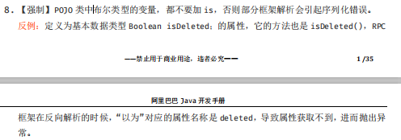
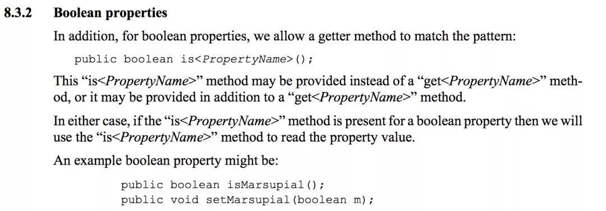
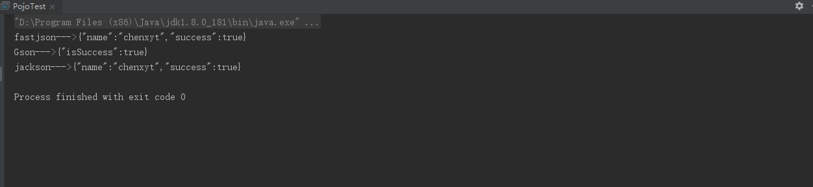
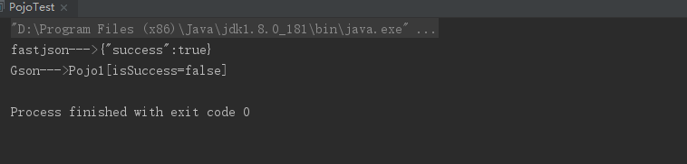
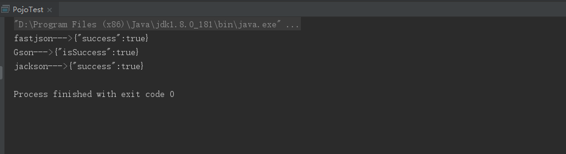
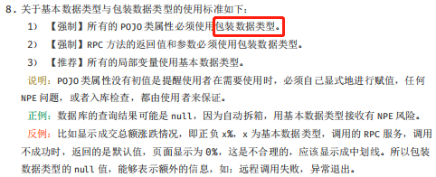

# 一、场景描述

&ensp;&ensp;&ensp;&ensp;在日常开发的过程中，我们经常需要在类中定义布尔类型的变量。比如在一个业务的执行过程中，设置一个标志变量，来判断业务是否执行成功。一般情况下，有如下四种定义形式。

```java
    private boolean success;
    
    private boolean isSuccess;
    
    private Boolean success;
    
    private Boolean isSuccess;
```

那么在开发中，究竟应该使用哪一种形式呢？下文逐步进行分析。

# 二、示例分析

&ensp;&ensp;&ensp;&ensp;上述四种形式主要有两部分的区别，第一部分是使用基本类型boolean还是使用包装类型Boolean；第二部分是使用success命名变量还是使用isSuccess。

## 使用succes还是isSuccess？

&ensp;&ensp;&ensp;&ensp;在阿里巴巴开发手册中，关于POJO类中的布尔类型变量，有如下强制性的规定：



(图片中Boolean应为boolean)

我们看下不同的变量在POJO类中有什么区别：

```java
package com.example.demo.pojo;
public class Pojo1 {

    private boolean success;

    public boolean isSuccess() {
        return success;
    }

    public void setSuccess(boolean success) {
        this.success = success;
    }
}
```

```java
package com.example.demo.pojo;
public class Pojo2 {

    private boolean isSuccess;

    public boolean isSuccess() {
        return isSuccess;
    }

    public void setSuccess(boolean success) {
        isSuccess = success;
    }
}
```

```java
package com.example.demo.pojo;
public class Pojo3 {

    private Boolean success;

    public Boolean getSuccess() {
        return success;
    }

    public void setSuccess(Boolean success) {
        this.success = success;
    }
}
```

```java
package com.example.demo.pojo;
public class Pojo4 {

    private Boolean isSuccess;

    public Boolean getSuccess() {
        return isSuccess;
    }

    public void setSuccess(Boolean success) {
        isSuccess = success;
    }
}
```

上边四个POJO类中的getter/setter方法均为IDEA编辑器自动生成。观察可以发现如下规律：

a.基本布尔类型boolean，getter/setter均为isXXX（）和setXXX（）的形式

b.包装布尔类型Boolean，getter/setter均为getXXX（）和setXXX（）的形式

&ensp;&ensp;&ensp;&ensp;假设此时我们使用基本布尔类型boolean，那么进一步分析Pojo1和Pojo2代码的区别。可以发现，虽然Pojo1和Pojo2中分别定义了success和isSuccess，但是它们自动生成的getter/setter方法都是isSuccess（）和setSucess（）。

&ensp;&ensp;&ensp;&ensp;Java Bean中关于getter/setter方法名的定义是有明确规定的。根据JavaBeans(TM) Specification规定，如果是普通类型的参数，命名为PropetyName，需要遵循如下的规范：

```java
public <PropertyType> get<PropertyName>();public void set<PropertyName>(<PropertyType> a);
```

但是，对于布尔类型变量PropertyName则是另一套规范：

```java
public boolean is<PropertyName>();public void set<PropertyName>(boolean m);
```



&ensp;&ensp;&ensp;&ensp;通过对照如上的规范，我们可以发现，按照规范中的约定，在Pojo2中定义的isSuccess对应的getter方法应该为isIsSuccess，而一般的编辑器都会默认生成为isSuccess（）

&ensp;&ensp;&ensp;&ensp;再看另一种情况，假设此时我们使用的是包装布尔类型Boolean，然后同样分析Pojo3和Pojo4代码的区别，可以发现同样的对于success和isSuccess两个变量，编辑器都自动生成了getSuccess（）

显然，对于isSuccess变量自动生成的getter/setter方法可能会产生问题。

&ensp;&ensp;&ensp;&ensp;在一般情况下，上述这种问题不会产生影响，但是在序列化和反序列化的过程中可能会产生致命的错误。

这里我们使用常用的JSON序列化举例，看看常用的fastjson、jackson和Gson之间的区别：

```java
package com.example.demo.pojo;

import com.alibaba.fastjson.JSON;
import com.fasterxml.jackson.core.JsonProcessingException;
import com.fasterxml.jackson.databind.ObjectMapper;
import com.google.gson.Gson;

public class PojoTest {
    public static void main(String[] args) throws JsonProcessingException {
        Pojo1 pojo1 = new Pojo1();
        pojo1.setSuccess(true);
        //使用fastjson进行序列化并输出
        System.out.println("fastjson--->" + JSON.toJSONString(pojo1));
        //使用Gson进行序列化输出
        Gson gson = new Gson();
        System.out.println("Gson--->" + gson.toJson(pojo1));
        //使用jackson进行序列化输出
        ObjectMapper objectMapper = new ObjectMapper();
        System.out.println("jackson--->" + objectMapper.writeValueAsString(pojo1));
    }
}

```

```java
package com.example.demo.pojo;

import java.io.Serializable;

public class Pojo1 implements Serializable {

    private  static  final long serialVersionUID = -804945564874861370L;

    private boolean isSuccess;

    public boolean isSuccess() {
        return isSuccess;
    }

    public void setSuccess(boolean success) {
        isSuccess = success;
    }

    public String getName(){
        return "chenxyt";
    }
}

```

&ensp;&ensp;&ensp;&ensp;上述修改之后的Pojo1中只有一个isSuccess变量以及编辑器自动生成的getter/setter方法和我按照指定规则编写的getter方法。

上述代码运行结果：



&ensp;&ensp;&ensp;&ensp;fastjson和jackson分别序列化出了一个success和一个name并赋值，而Gson只序列化出一个isSuccess，可见不同的序列化方式会产生不同的结果。进一步分析结果可以看出，fastjson和jackson是通过反射遍历所有getter方法然后根据Java Bean命名规范而进行序列化的，它会认为这个POJO类中有一个success变量和一个name变量。

```java
fastjson--->{"name":"chenxyt","success":true}
jackson--->{"name":"chenxyt","success":true}
```

而Gson则是通过反射遍历类中的属性，把其序列化成Json。

```java
Gson--->{"isSuccess":true}
```

&ensp;&ensp;&ensp;&ensp;那么我们使用fastjson序列化，然后使用Gson进行反序列化会产生什么结果呢？方才的name仅仅是为了验证三种序列化的方式差异，因此将其抛开来验证新的问题。

```java
package com.example.demo.pojo;

import java.io.Serializable;
import java.util.StringJoiner;

public class Pojo1 implements Serializable {

    private  static  final long serialVersionUID = -804945564874861370L;

    private boolean isSuccess;

    public boolean isSuccess() {
        return isSuccess;
    }

    public void setSuccess(boolean success) {
        isSuccess = success;
    }

    @Override
    public String toString() {
        return new StringJoiner(", ", Pojo1.class.getSimpleName() + "[","]")           .add("isSuccess=" + isSuccess)           .toString();
    }
}

```

```java
package com.example.demo.pojo;

import com.alibaba.fastjson.JSON;
import com.fasterxml.jackson.core.JsonProcessingException;
import com.google.gson.Gson;

public class PojoTest {
    public static void main(String[] args) throws JsonProcessingException {
        Pojo1 pojo1 = new Pojo1();
        pojo1.setSuccess(true);
        //使用fastjson进行序列化并输出
        System.out.println("fastjson--->" + JSON.toJSONString(pojo1));
        //使用Gson进行反序列化输出
        Gson gson = new Gson();
        System.out.println("Gson--->" + gson.fromJson(JSON.toJSONString(pojo1),Pojo1.class));
    }
}

```

运行结果：



&ensp;&ensp;&ensp;&ensp;这和我们预期的结果完全不同，这是因为fastjson在通过遍历getter方法然后根据Java Bean命名规范生成JSON对象时，生成了{”success“:true}，而Gson在进行反序列化的时候，遍历整个POJO类的属性只发现了isSuccess，因此将isSuccess反序列化并赋与默认值false。这在生产环境，绝壁是致命问题啊！！！

&ensp;&ensp;&ensp;&ensp;接下来验证另外一种假设，同样是基于success和isSuccess的前提下，使用包装Boolean的情况。可以预测结果和上边的结果没有什么不同。

首先验证序列化

```java
package com.example.demo.pojo;
public class Pojo4 {

    private Boolean isSuccess;

    public Boolean getSuccess() {
        return isSuccess;
    }

    public void setSuccess(Boolean success) {
        isSuccess = success;
    }
}

```

```java
package com.example.demo.pojo;

import com.alibaba.fastjson.JSON;
import com.fasterxml.jackson.core.JsonProcessingException;
import com.fasterxml.jackson.databind.ObjectMapper;
import com.google.gson.Gson;

public class PojoTest {
    public static void main(String[] args) throws JsonProcessingException {
        Pojo4 pojo4 = new Pojo4();
        pojo4.setSuccess(true);
        //使用fastjson进行序列化并输出
        System.out.println("fastjson--->" + JSON.toJSONString(pojo4));
        //使用Gson进行序列化输出
        Gson gson = new Gson();
        System.out.println("Gson--->" + gson.toJson(pojo4));
        //使用jackson进行序列化输出
        ObjectMapper objectMapper = new ObjectMapper();
        System.out.println("jackson--->" + objectMapper.writeValueAsString(pojo4));
    }
}
```

运行结果:



与使用基本布尔类型的结果一致。

然后验证反序列化：

```java
package com.example.demo.pojo;

import java.util.StringJoiner;

public class Pojo4 {

    private Boolean isSuccess;

    public Boolean getSuccess() {
        return isSuccess;
    }

    public void setSuccess(Boolean success) {
        isSuccess = success;
    }
    @Override
    public String toString() {
        return new StringJoiner(", ", Pojo4.class.getSimpleName() + "[","]")           .add("isSuccess=" + isSuccess)           .toString();
    }
}
```

```java
package com.example.demo.pojo;

import com.alibaba.fastjson.JSON;
import com.google.gson.Gson;

public class PojoTest {

    public static void main(String[] args) {
        Pojo4 pojo4 = new Pojo4();
        pojo4.setSuccess(true);
        //使用fastjson进行序列化并输出
        System.out.println("fastjson--->" + JSON.toJSONString(pojo4));
        //使用Gson进行反序列化输出
        Gson gson = new Gson();
        System.out.println("Gson--->" + gson.fromJson(JSON.toJSONString(pojo4),Pojo4.class));
    }
}
```

运行结果：


这里区别出现了！

## 使用Boolean还是boolean？

&ensp;&ensp;&ensp;&ensp;如上我们验证了使用isSuccess在序列化和反序列化过程中会造成的异常情况。然后对比使用基本布尔类型boolean和包装布尔类型Boolean的不同，在对一个没有的属性进行反序列的时候，基本布尔类型会默认赋值false，而包装布尔类型会默认赋值null

在阿里巴巴开发手册中有如下规定：



&ensp;&ensp;&ensp;&ensp;这里建议我们使用包装类型，理由是包装类型在数据属性为空的时候会默认赋值为null，而基本数据类型在属性为空的时候则会赋值为false或者诸如在double中的0，这在生产环境下很有可能会产生一些微妙的异常情况。

&ensp;&ensp;&ensp;&ensp;个人觉得，无论是null还是默认的false与0也好，从本质上讲无非是我们如何在代码中正确的对异常情况进行处理。毕竟代码中出现没有意义的null也未必见得就是一件好事。

# 三、总结

&ensp;&ensp;&ensp;&ensp;在开发过程中，对于需要对业务进行判断成功与失败的标志变量，避免使用isXXX的命名形式。因为编辑器根据Java Bean的命名规范，会将其自动生成的getter/setter方法中的Is省略。从而在序列化与反序列化的过程中产生异常。

此外，对于基本布尔类型，与包装布尔类型，其实没有哪一种是绝对完美的，完美的是如何处理异常。